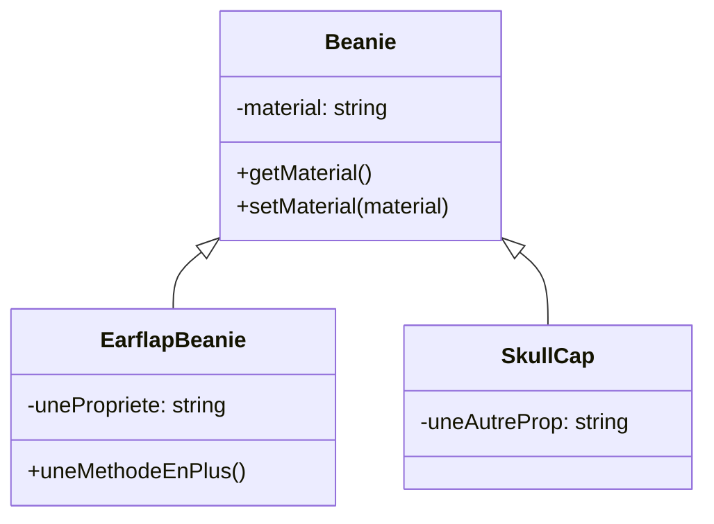

# PHP Orienté objet

[La documentation PHP](https://www.php.net/manual/fr/language.oop5.basic.php)
[Sur OpenClassRooms](https://openclassrooms.com/fr/courses/1665806-programmez-en-oriente-objet-en-php)

## Une classe

<div style="position: relative; padding-bottom: 56.25%; height: 0;"><iframe src="https://www.loom.com/embed/6fca744165694a70bd531306742ad942" frameborder="0" webkitallowfullscreen mozallowfullscreen allowfullscreen style="position: absolute; top: 0; left: 0; width: 100%; height: 100%;"></iframe></div>

En PHP, une classe se nomme en PascalCase, est l'unique contenu d'un fichier (par convention, ça n'est pas obligatoire) et peut avoir :

- des constantes
- des propriétés
- des méthodes
- des appels de traits

:warning: Ne pas confondre classe et objet. Une classe est un plan de fabrication, l'objet est une instance (une version concrète) de cette classe. On peut également faire un parallèle avec les <abbr title="Base de Données">BdD</abbr> : les classes peuvent être comparées aux tables, là où les objets sont des lignes de cette table.

```php
<?php
// classes/Beanie.php

// Nom avec une majuscule entre chaque mot et dès le premier mot
class Beanie
{
    // Une propriété.
    // On ne peut pas en définir le type directement,
    // mais on peut l'indiquer en annotation 
    protected string $material; 
    
    public function __construct() 
    {
        $this->material = 'Wool';
    }

     // Une méthode
     // sans type de retour, mais on pourrait l'ajouter
     // et/ou l'indiquer en annotation
    public function getMaterial()
    {
        return $this->material;
    }
    
    /**
     * @param string|null $material
     * @return $this
     */
    public function setMaterial(?string $material): Beanie
    {
         $this->material = $material;
         
         return $this;
    }
}

// index.php
// Instanciation d'un objet
// Et appel d'une méthode
$beanie = new Beanie();
$beanie->setMaterial('Wool');
$beanie->getMaterial();
```

## Utiliser nos classes

En vidéo :

<div style="position: relative; padding-bottom: 56.25%; height: 0;"><iframe src="https://www.loom.com/embed/0da07d720ac748278bc68214d3c92ebc" frameborder="0" webkitallowfullscreen mozallowfullscreen allowfullscreen style="position: absolute; top: 0; left: 0; width: 100%; height: 100%;"></iframe></div>

En PHP, par défaut, les classes ne sont pas chargées automatiquement, il faut les charger nous-même (soit avec `require`/`require_once`, soit avec un autoloader qui le fera pour nous).

```php
require 'classes/MaClasse.php';
```

Ou utiliser un autoloader :

```php
spl_autoload_register(function ($class) { 
    require_once "classes/$class.php";
});
```

Si vous utilisez un Mac, avec Mamp, utilisez plutôt ce code : 

```php
spl_autoload_register(function ($class) {
    $class = str_replace('\\', '/', $class);
    require_once "classes/$class.php";
});
```

## Documenter ses classes

Les annotations et le typage sont très utiles pour définir les types des propriétés, paramètres et valeurs de retour. Hélas, en PHP 7, nous ne pouvons pas toujours typer directement les propriétés. Nous sommes obligés d'utiliser les annotations pour le faire (c'est disponible à partir de PHP 7.4 seulement).

En PHP, une variable peut également avoir plusieurs types possibles. On notera alors ces types en annotation, dans la plupart des cas (`int|float` par exemple). Pour le cas d'une valeur pouvant être `null`, on ajoutera un `?` avant le type (`?int` par exemple).

```php
class Beanie 
{
    /** @var array */
    protected $material = []; // On indique le(s) type(s) attendu(s)
    
    /**
     * @param bool $aCondition
     * 
     * @return array
     */
    public function getMaterial(bool $aCondition = false): array
    {
        return $this->material;
    }
}
```

## `$this` : pseudo-variable, vraie utilité

En vidéo : 

<div style="position: relative; padding-bottom: 56.25%; height: 0;"><iframe src="https://www.loom.com/embed/7f6a2fce59f349e891e4f5f4970f4696" frameborder="0" webkitallowfullscreen mozallowfullscreen allowfullscreen style="position: absolute; top: 0; left: 0; width: 100%; height: 100%;"></iframe></div>

`$this` permet d'accéder à l'objet en cours. Toujours utile pour le mettre à jour !
Il est nécessaire pour assurer l'encapsulation de nos propriétés (on ne les modifie jamais directement, mais toujours *via* des méthodes).

```php
class Beanie 
{
    protected $material;
     
    public function getMaterial() // Une méthode
    {
        // $this, utilisée dans un objet permet d'accéder à l'objet en cours
        return $this->material;
    }
}
```

## Constructeur

En vidéo :

<div style="position: relative; padding-bottom: 56.25%; height: 0;"><iframe src="https://www.loom.com/embed/aaccabba313c4c9d89846e058161249d" frameborder="0" webkitallowfullscreen mozallowfullscreen allowfullscreen style="position: absolute; top: 0; left: 0; width: 100%; height: 100%;"></iframe></div>

On peut définir des valeurs par défaut (ou d'initialisation) pour les propriétés d'un objet dans le constructeur ou dans les propriétés. Les deux sont équivalents la plupart du temps, mais pas pour des valeurs complexes (par exemple, si vous devez instancier un objet pour l'un des propriétés, il est nécessaire de le faire dans le constructeur).

```php
class Beanie 
{
    // On peut donner une valeur par défaut directement sur la propriété
    protected string $material = 'wool';
    
    public function __construct()
    {
        // La même chose, mais, ici, on peut faire des calculs,
        // appeler des méthodes de l'objet, etc.
        $this->material = 'wool'; 
    }
}
```

Vous pouvez également, si vous le souhaitez, définir des paramètres à votre constructeur (y compris pour définir les propriétés).


```php
class Beanie 
{
    protected string $material;
    
    // On permet de définir la valeur directement lors du new
    // et on peut donner une valeur par défaut directement au paramètre
    public function __construct(string $material = 'wool')
    {
        $this->material = $material; 
    }
}
```

## Constantes de classe

En vidéo :

<div style="position: relative; padding-bottom: 56.25%; height: 0;"><iframe src="https://www.loom.com/embed/5f6d80ecbe3c443a80164f0852deab58" frameborder="0" webkitallowfullscreen mozallowfullscreen allowfullscreen style="position: absolute; top: 0; left: 0; width: 100%; height: 100%;"></iframe></div>

La [documentation sur les constantes](https://www.php.net/manual/fr/language.oop5.constants.php)

```php
class Beanie 
{
    const AVAILABLE_SIZES = ['S', 'M', 'L', 'XL']; // Une constante de classe
    
    public function getAvailableSizes()
    {
        return self::AVAILABLE_SIZES;
    }
}
var_dump(Beanie::AVAILABLE_SIZES); 
```

## $this ou self ?

En vidéo : 

<div style="position: relative; padding-bottom: 56.25%; height: 0;"><iframe src="https://www.loom.com/embed/c8e3bd5d9cae40048161b17e8c1749d6" frameborder="0" webkitallowfullscreen mozallowfullscreen allowfullscreen style="position: absolute; top: 0; left: 0; width: 100%; height: 100%;"></iframe></div>

- Les deux s'utilisent dans la classe,
- `$this` si vous êtes dans le contexte d'un objet instancié ("j'ai des propriétés/méthodes, je vais m'en servir")
- `self` pour appeler des éléments dits `static` (constantes, méthodes statiques) ("Des éléments sont définis par la classe, je veux m'en servir dans mon objet")

```php
class Beanie 
{
    const AVAILABLE_SIZES = ['S', 'M', 'L', 'XL']; // Appelée avec Beanie::AVAILABLE_SIZES
    
    public static $property; // Appelée avec Beanie::$property
    
    public function getAvailableSizes()
    {
        return self::AVAILABLE_SIZES; // appelée avec $b->getAvailableSizes()
    }
    
    public static function availableSizes()
    {
        return self::AVAILABLE_SIZES; // appelée avec Beanie::availableSizes()
    }
}
```

## Héritage

En vidéo :

<div style="position: relative; padding-bottom: 56.25%; height: 0;"><iframe src="https://www.loom.com/embed/aab9a13a3af34b149c43515814fe8820" frameborder="0" webkitallowfullscreen mozallowfullscreen allowfullscreen style="position: absolute; top: 0; left: 0; width: 100%; height: 100%;"></iframe></div>

On parle d'héritage quand une classe hérite d'une autre. C'est-à-dire qu'elle en récupère l'ensemble des propriétés et méthodes, à conditions qu'elles aient une visibilité `public` ou `protected`.

:warning: En Php, une classe ne peut héritée que d'une classe.

Prenons le schéma suivant et voyons son implémentation en PHP :




[Des types de bonnets sous-côtés](https://blog.delusionmfg.com/12-types-of-beanies-you-have-to-check-out)

```php
class EarflapBeanie extends Beanie
{
    // À accès aux propriétés et aux méthodes de Beanie, mais uniquement si public ou protected 
    // Cette propriété n'existe que pour les objets EarflapBeanie
    private string $unePropriete;
    
    // On peut également surcharger le constructeur (ou toute autre méthode de l'objet parent)
    // pour ajouter des comportements
    public function __construct()
    {
        // On peut appeler le constructeur du parent (pour en garder le fonctionnement)
        parent::__construct();
        // En général, on veut ajouter des comportements spécifiques après l'appel du constructeur parent
        $this->unePropriete = true; 
    }
    
    public function uneMethodeEnPlus()
    {
        // Cette méthode n'est pas utilisable sur un objet Beanie, mais uniquement par les objets EarflapBeanie
    }
}


class SkullCap extends Beanie
{
    private string $uneAutreProp;
}
```

## Visibilité

En vidéo :

<div style="position: relative; padding-bottom: 56.25%; height: 0;"><iframe src="https://www.loom.com/embed/23844c48057e457f88e355fdfe15dd41" frameborder="0" webkitallowfullscreen mozallowfullscreen allowfullscreen style="position: absolute; top: 0; left: 0; width: 100%; height: 100%;"></iframe></div>

- `public` : la propriété / méthode est utilisable en dehors de l'objet
- `private` : la propriété / méthode **n'est pas** utilisable en dehors de l'objet
- `protected` : la propriété / méthode n'est utilisable **que** par les classes enfants (voir section sur l'héritage)

```php
class Beanie 
{
    protected $name;
    private $test;
    public $description;
}
class EarflapBeanie extends Beanie
{
    // On peut utiliser / surcharger $this->name et $this->$description
    // mais pas $this->test qui n'est disponible QUE dans les objets Beanie et pas leurs enfants
}
```

## FQCN et `get_class()`

<div style="position: relative; padding-bottom: 56.25%; height: 0;"><iframe src="https://www.loom.com/embed/33d964336c744c62a63b5d30bec3a3e7" frameborder="0" webkitallowfullscreen mozallowfullscreen allowfullscreen style="position: absolute; top: 0; left: 0; width: 100%; height: 100%;"></iframe></div>

Il arrive qu'on ait besoin de récupérer le nom complet de notre classe (avec son *namespace* complet), qu'on appelle aussi <abbr title="Fully Qualified Class Name">FQCN (Fully Qualified Class Name)</abbr>. Pour cela, nous avons 2 moyens :
- la fonction `get_class()` qui retourne :
  - le nom complet de l'objet en cours, si utilisé dans une classe, sans paramètre (appel : `get_class()`)
  - le nom complet de l'objet passé en paramètre (appel : `get_class(new DateTime())` ou `get_class($foo)`)
- `NomDeLaClasse::class` qui nous permet de récupérer le <abbr title="Fully Qualified Class Name">FQCN</abbr> directement à partir du nom de la classe

```php
abstract class Bar
{
    public function __construct()
    {
        // On récupère l'objet réellement en cours
        var_dump(get_class($this));
        // On récupère l'objet où la déclaration est faite
        var_dump(get_class());
    }
}

class Foo extends Bar {
}

$foo = new Foo();
var_dump(Foo::class); // Renvoie la même chose que get_class($foo)

```

## instanceof

<div style="position: relative; padding-bottom: 56.25%; height: 0;"><iframe src="https://www.loom.com/embed/bb19555096894924b4dd51d4e4af0564" frameborder="0" webkitallowfullscreen mozallowfullscreen allowfullscreen style="position: absolute; top: 0; left: 0; width: 100%; height: 100%;"></iframe></div>

Le mot-clé `ìnstanceof` permet de vérifier si une variable est une instance d'une classe, d'une interface ou d'une de ses filles.

```php
// Bar.php
class Bar {}
// Foo.php
class Foo extends Bar {}
// index.php
$foo = new Foo();
$bar = new Bar();
var_dump($foo instanceof Foo); // Bool (true)
var_dump($foo instanceof Bar); // Bool (true)
var_dump($foo instanceof Test); // Bool (false)
```

## Classes et méthodes abstraites

[La documentation](https://www.php.net/manual/fr/language.oop5.abstract.php)

<div style="position: relative; padding-bottom: 56.25%; height: 0;"><iframe src="https://www.loom.com/embed/593e1d83b8774b1a9eac0f7392b68942" frameborder="0" webkitallowfullscreen mozallowfullscreen allowfullscreen style="position: absolute; top: 0; left: 0; width: 100%; height: 100%;"></iframe></div>

Une classe abstraite sert à définir un ensemble de propriétés et de méthodes, qui seront utilisables dans les classes filles. Cette classe ne peut être instanciée (on ne peut pas faire un `new`). 

L'intérêt est de regrouper des propriétés et méthodes communes, sans permettre d'instancier la classe. On ne peut par exemple pas faire un `new Animal` dans l'exemple ci-dessous. Il faut instancier les classes filles à la place.

Une méthode abstraite peut être définie dans une classe abstraite. On écrit le mot-clé `abstract` suivi de la signature de la fonction.
Son but est de forcer l'implémentation de la méthode dans les classes filles (qui devront donner un corps à la méthode).

```php
abstract class Animal 
{
    abstract public function call(): string;
}

class Dog extends Animal
{
    // Pour étendre Animal, Dog DOIT avoir une méthode call() définie
    public function call(): string
    {
        return 'Waf';
    }
}
```

## Interface

[La documentation](https://www.php.net/manual/fr/language.oop5.interfaces.php)

<div style="position: relative; padding-bottom: 56.25%; height: 0;"><iframe src="https://www.loom.com/embed/103e62866bfc4beb871e10e79d16b00d" frameborder="0" webkitallowfullscreen mozallowfullscreen allowfullscreen style="position: absolute; top: 0; left: 0; width: 100%; height: 100%;"></iframe></div>

Une interface permet de forcer l'implémentation de certaines méthodes dans un objet. C'est un contrat, permettant d'assurer que certaines méthodes sont définies et implémentées dans une ou plusieurs classes.

:warning: Une classe peut implémenter plusieurs interfaces.

:warning: Une interface peut étendre un ou plusieurs interfaces.

```php
interface Test
{
    public function getTest();
}

class Foo implements Test, Test2, Test3
{
    // Pour implémenter Test, Foo DOIT avoir une méthode getTest() définie
    public function getTest()
    {
        return 'ok';
    }
}
```

## Traits

[La documentation](https://www.php.net/manual/fr/language.oop5.traits.php)

<div style="position: relative; padding-bottom: 56.25%; height: 0;"><iframe src="https://www.loom.com/embed/4b9cd3e24b604c799d6e7ec10d40de06" frameborder="0" webkitallowfullscreen mozallowfullscreen allowfullscreen style="position: absolute; top: 0; left: 0; width: 100%; height: 100%;"></iframe></div>

Un trait fonctionne comme une classe et permet de regrouper des propriétés et des méthodes qui vont ête utilisées dans d'autres classes. Un trait ne peut pas être instancié. Il s'utilise avec `use` (oui, encore !) pour **inclure** le code du trait dans une classe. 

Pensez l'utilisation d'un trait comme un copier-coller dans une classe : vous prenez tout le contenu du trait et le collez là où l'appel est fait.

Un exemple de déclaration de trait, où on déclare une propriété et un getter :

```php
trait TestTrait 
{
    private $test;
    private function getTest()
    {
        // ...
    }
}
```

Un exemple d'utilisation de ce trait dans une classe :

```php
class Test
{
    use TestTrait; 
    use TestTrait2;
    // Ici, on peut utiliser $this->test et $this->getTest(),
    // meme s'ils sont privés ! 
    // Comme les éléments sont inclus, $this->test
    // est déclaré privé dans la classe Test
}
```

## Espaces de nom

<div style="position: relative; padding-bottom: 56.25%; height: 0;"><iframe src="https://www.loom.com/embed/3f3b43f9369b42cfba40d956e9aedaa4" frameborder="0" webkitallowfullscreen mozallowfullscreen allowfullscreen style="position: absolute; top: 0; left: 0; width: 100%; height: 100%;"></iframe></div>

Le nommage d'une classe (on parle de nom complet ou <abbr title="Fully Qualified Class Name">FQCN</abbr>) ne se limite pas au seul nom de la classe. Le <abbr title="Fully Qualified Class Name">FQCN</abbr> contient également l'espace de nom de la classe, c’est-à-dire un éventuel préfixe et le dossier où la classe se trouve.
Ce <abbr title="Fully Qualified Class Name">FQCN</abbr> se base sur un dossier (dans notre exemple `classes`).

Imaginons l'organisation suivante :

```
classes/
| - Traits/
    | - Truc/
        | - TestTrait2.php
    | - TestTrait.php
| - Foo.php
| - Bar.php
| - Baz.php
```

Si `classes` est le dossier servant de base à nos classes PHP, les différentes classes auront (ou non) un namespace (espace de nom). Par exemple, `Foo`, `Bar`, `Baz` n'auront pas de namespace (ils sont à la racine de nos classes), alors que `TestTrait` et `TestTrait2` auront un namespace, pour indiquer le dossier où il se trouve :

```php
// classes/Traits/TestTrait.php
namespace Traits;

trait TestTrait 
{
// ...
}


// classes/Traits/Truc/TestTrait2.php
namespace Traits\Truc;

trait TestTrait2
{
// ...
}
```

:warning: La séparation des dossiers s'écrit avec un `\` dans les namespaces

## Exceptions et try/catch

<div style="position: relative; padding-bottom: 56.25%; height: 0;"><iframe src="https://www.loom.com/embed/de998293df9c484ab5a2eac6faf885a0" frameborder="0" webkitallowfullscreen mozallowfullscreen allowfullscreen style="position: absolute; top: 0; left: 0; width: 100%; height: 100%;"></iframe></div>

En Php, et dans de nombreux autres langages orientés objet, une mécanique permet de gérer les erreurs : les exceptions. Il faut les comprendre comme "des cas non prévus" du programme et, lorsqu'une exception est levée (qu'une erreur se produit), le programme peut réagir en fonction.

Cela permet par exemple d'utiliser une connexion de secours si une première BdD ne répond pas, ou de réagir à n'importe quelle erreur **prévue** dans notre programme.
Php propose déjà un objet `Exception`, vous permettant d'en créer une et vous pouvez la lever avec le mot-clé `throw`. 

Une exception peut être attrapée, pour la traiter ou afficher le message d'erreur, avec le bloc try/catch : 

```php
function throwException() {
    // Pour lever une exception, on utilise le mot-clé throw
    throw new Exception('Ceci est une exception');
}

// On peut "tester" des instructions dans un bloc try
// Si une exception est levée dans ces instructions,
// on peut les attraper dans un ou des blocs catch
try {
    throwException();
} catch(Exception $e) {
    echo $e->getMessage();
}
```

## Exercices

Pour vous entrainer à manipuler des objets PHP, utiliser le [repository Github dédié à divers exercices](https://github.com/Dreeckan/exercices-php/). Les exercices 1 à 7 concernent cette partie.