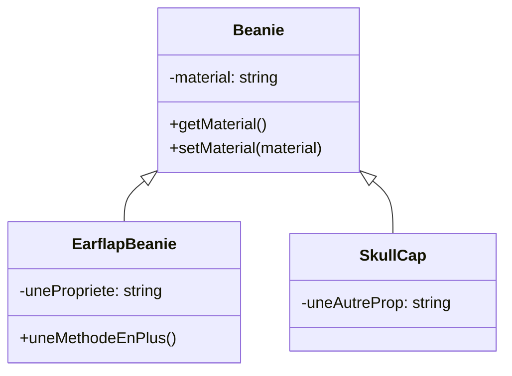

# Héritage

En vidéo :

<div style="position: relative; padding-bottom: 56.25%; height: 0;"><iframe src="https://www.loom.com/embed/aab9a13a3af34b149c43515814fe8820" frameborder="0" webkitallowfullscreen mozallowfullscreen allowfullscreen style="position: absolute; top: 0; left: 0; width: 100%; height: 100%;"></iframe></div>

On parle d'héritage quand une classe hérite d'une autre. C'est-à-dire qu'elle en récupère l'ensemble des propriétés et méthodes, à conditions qu'elles aient une visibilité `public` ou `protected`.

:warning: En Php, une classe ne peut héritée que d'une classe.

Prenons le schéma suivant et voyons son implémentation en PHP :




[Des types de bonnets sous-côtés](https://blog.delusionmfg.com/12-types-of-beanies-you-have-to-check-out)

```php
class EarflapBeanie extends Beanie
{
    // À accès aux propriétés et aux méthodes de Beanie, mais uniquement si public ou protected 
    // Cette propriété n'existe que pour les objets EarflapBeanie
    private bool $unePropriete;
    
    // On peut également surcharger le constructeur (ou toute autre méthode de l'objet parent)
    // pour ajouter des comportements
    public function __construct()
    {
        // On peut appeler le constructeur du parent (pour en garder le fonctionnement)
        parent::__construct();
        // En général, on veut ajouter des comportements spécifiques après l'appel du constructeur parent
        $this->unePropriete = true; 
    }
    
    public function uneMethodeEnPlus()
    {
        // Cette méthode n'est pas utilisable sur un objet Beanie, mais uniquement par les objets EarflapBeanie
    }
}


class SkullCap extends Beanie
{
    private string $uneAutreProp;
}
```

## Visibilité

En vidéo :

<div style="position: relative; padding-bottom: 56.25%; height: 0;"><iframe src="https://www.loom.com/embed/23844c48057e457f88e355fdfe15dd41" frameborder="0" webkitallowfullscreen mozallowfullscreen allowfullscreen style="position: absolute; top: 0; left: 0; width: 100%; height: 100%;"></iframe></div>

- `public` : la propriété / méthode est utilisable en dehors de l'objet
- `private` : la propriété / méthode **n'est pas** utilisable en dehors de l'objet
- `protected` : la propriété / méthode n'est utilisable **que** par les classes enfants (voir section sur l'héritage)

```php
class Beanie 
{
    protected ?string $name = null;
    private bool $test = true;
    public ?string $description = null;
}
class EarflapBeanie extends Beanie
{
    // On peut utiliser / surcharger $this->name et $this->$description
    // mais pas $this->test qui n'est disponible QUE dans les objets Beanie et pas leurs enfants
}
```